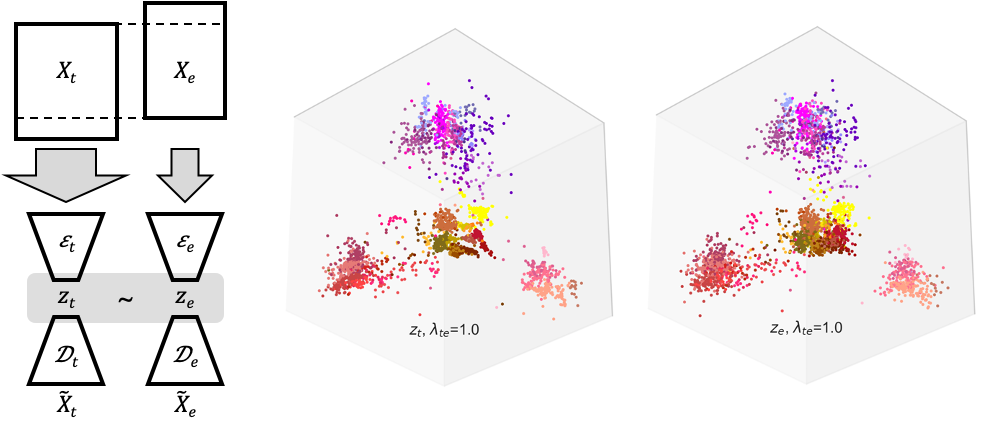

**[Consistent cross-modal identification of cortical neurons with coupled autoencoders](https://www.biorxiv.org/content/10.1101/2020.06.30.181065v1)**

**Abstract**
>Consistent identification of neurons and neuronal cell types across different observation modalities is an important problem in neuroscience. Here, we present an optimization framework to learn coordinated representations of multimodal data, and apply it to a large Patch-seq dataset of mouse cortical interneurons. Our approach reveals strong alignment between transcriptomic and electrophysiological profiles of neurons, enables accurate cross-modal data prediction, and identifies cell types that are consistent across modalities.

**Data**
 - [Allen Institute Patch-seq dataset](https://portal.brain-map.org/explore/classes/multimodal-characterization)
 - `/data/proc/`: contains processed data used as starting point for analyses in the manuscript
    - `PS_v5_beta_0-4_pc_scaled_ipfx_eqTE.mat`: log1p(cpm) gene expression values, normalized electrophysiology feature values and cell type annotations based on [Gouwens N. & Sorensen S. et al. 2020](https://www.biorxiv.org/content/10.1101/2020.02.03.932244v1.abstract)
    - `dend_RData_Tree_20181220.csv`: Reference hierarchicy of cortical cell types based on [Tasic B., Yao Z., Graybuck L. & Smith K. et al. 2018](https://www.nature.com/articles/s41586-018-0654-5)

**Environment**
- Neural network tested with `tensorflow 2.1`
- `requirements.yml`: conda environment specification

**Code**
 - `model.py`: coupled autoencoder implementation
 - `train.py`: specifies the training
 - `/utils`: helper functions
 - `/notebooks/`: simplified examples for the main results of the manuscript.
    - `model_training.ipynb`: short training run for a coupled autoencoder model 
    - `clustering.ipynb`: unsupervised, _de novo_ clustering of the aligned representations for the Patch-seq dataset
    - `crossmodal_prediction.ipynb`: cross-modal prediction for validation cells using a pre-trained network
 
